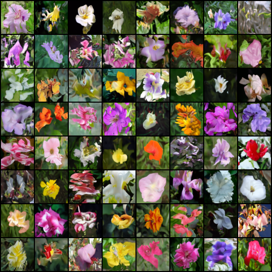
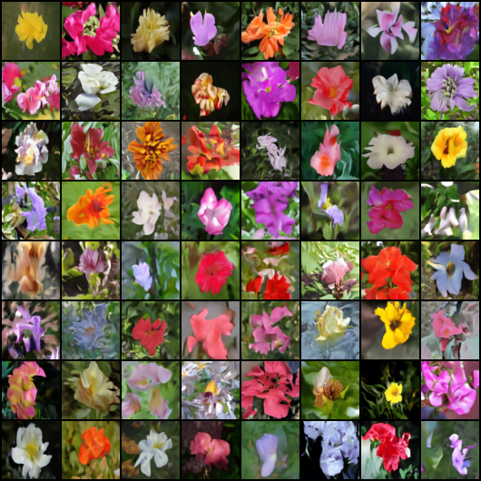

<div>
  <div align="center">
    
  </div>


  <div align="center">
    
  </div>


  <div align="center">
    
  </div>


  <div align="center">
    
  </div>

  <div align="center">
      <!-- 渐变色谱：从橙色到紫色 -->
      
      
      
      
      
  </div>

[](https://pytorch.org/)
[](https://arxiv.org/abs/2006.11239)
[](https://github.com/facebookresearch/DiT)
[](LICENSE)
[](https://www.python.org/)
</div>


---

<div align="center">

# ✨ Diffusion Models Collection

**一个全面、工程化、基于 PyTorch 的现代扩散模型实现库。**

支持 DDPM、DDIM、CFG 等多种扩散算法，集成 UNet、DiT、DiM 等先进主干网络。  
提供分布式训练、EMA、实验追踪、完整评估指标，开箱即用。

[简介](#-1-简介) • [项目结构](#-3-项目结构) • [安装指南](#️-4-安装指南) • [快速开始](#-5-快速开始)
</div>


[English](README_EN.md) | [中文](README.md)
---

## 📖 1 简介

本项目提供了一个模块化且易于扩展的去噪扩散概率模型 (DDPM) 和去噪扩散隐式模型 (DDIM) 实现。支持多种主流的主干网络架构，包括经典的 **UNet**、基于 Transformer 的 **DiT** (Diffusion Transformer) 以及最前沿的 **DiM** (Diffusion Mamba)。

项目专为研究和工程落地设计，提供了统一的训练、采样和评估接口，并支持多 GPU 分布式训练 (DDP) 和实验追踪。

## 🚀 2 功能特性

- **🧠 先进的主干网络 (Backbones)**
  - **UNet**: 经典的残差块 + 自注意力机制架构。
  - **DiT**: 可扩展的 Diffusion Transformer 架构。
  - **DiM**: 高效的 Diffusion Mamba (状态空间模型) 架构。

- **⚡ 采样策略**
  - **DDPM**: 标准随机采样，生成质量高。
  - **DDIM**: 确定性加速采样，推理速度快。
  - **CFG**: 无分类器引导 (Classifier-Free Guidance)，用于条件生成。

- **📦 全面的数据集支持**
  - 内置支持: CIFAR-10, CIFAR-100, MNIST, FashionMNIST, CelebA。
  - **自定义数据集**: 支持通过文件夹结构或 JSON 标签文件灵活加载私有数据。

- **🛠️ 工程化特性**
  - **分布式训练**: 无缝支持 DDP (Distributed Data Parallel) 多卡训练。
  - **EMA**: 指数移动平均 (Exponential Moving Average)，稳定模型权重。
  - **实验追踪**: 集成 [SwanLab](https://swanlab.cn) 实现实时训练监控。
  - **评估指标**: 内置 FID, Inception Score (IS), 和 LPIPS 计算工具。

---

## 📂 3 项目结构

```text
DDPM_structure/
├── configs/                # 配置文件
│   ├── cifar10_dim.py
│   ├── cifar10_dit.py
│   ├── cifar10_dit.yml
│   ├── cifar10_unet.py
│   └── cifar10_unet.yml
├── datasets/               # 数据集加载逻辑
│   ├── __init__.py
│   ├── base_dataset.py
│   └── custom_dataset.py
├── diffusion/              # 扩散过程核心 (DDPM/DDIM)
│   ├── __init__.py
│   ├── ddpm.py
│   └── ddim.py
├── metrics/                # 评估指标计算
│   ├── __init__.py
│   ├── fid.py
│   ├── inception_score.py
│   └── lpips_score.py
├── models/                 # 模型主干架构
│   ├── __init__.py
│   ├── unet.py
│   ├── dit.py
│   └── dim.py
├── utils/                  # 工具函数
│   ├── __init__.py
│   ├── trainer.py
│   └── helpers.py
├── train.py                # 训练主脚本
├── sample.py               # 推理/采样脚本
├── evaluate.py             # 评估脚本
├── requirements.txt        # 依赖列表
└── LICENSE                 # 许可证文件
```

---

## 🛠️ 4 安装指南

1. **克隆仓库**
   ```bash
   git clone https://github.com/sunyzhi55/Diffusion_Models_Collection.git
   cd Diffusion_Models_Collection
   ```

2. **安装依赖**
   ```bash
   pip install -r requirements.txt
   ```

3. **(可选) 安装 Mamba**
   如果你计划使用 DiM (Mamba) 模型：
   ```bash
   pip install mamba-ssm
   ```

---

## ⚡ 5 快速开始

### 5.1 训练 (Training)

`train.py` 脚本同时支持单卡和多卡 (DDP) 训练。

**关于 CFG 训练（无分类器引导）**
- 若 `conditional=True`，数据集标签会在内部整体 +1，0 专门保留为“无条件”标签；请确保 `num_classes` 与数据一致。
- 通过 `cfg_dropout_prob`（配置项，默认 0.2）随机将部分样本的标签置为 0，用于训练无条件分支；设为 0 可关闭。
- DDP 下不需要 `find_unused_parameters=True`，因为空标签仍走同一前向分支。

1、**单 GPU 训练:**

修改配置文件中的 `gpu_ids`

```python
config = {
    # ...
    'gpu_ids': [0],  # 使用 GPU 0
    # ...
}
```

然后运行：

```bash
# 在 CIFAR-10 上训练 UNet
python train.py --config configs/cifar10_unet.py

# 训练 DiT 模型
python train.py --config configs/cifar10_dit.py
```

2、**多 GPU 分布式训练 (DDP，基于 torchrun):**

多卡启动不再使用 `torch.multiprocessing`，请通过 `torchrun` 管理进程，可选 `gpu_ids` 控制具体卡：

```bash
# 使用 4 张 GPU 进行训练
torchrun --nproc_per_node=4 --master_port=12355 train.py --config configs/cifar10_unet.py

# nohup 示例（后台运行）
nohup setsid torchrun --nproc_per_node=2 --master_port=15355 train.py --config configs/cifar10_unet.py > result.out &
```

> 说明：
> - `--nproc_per_node` 控制单机进程数（通常等于使用的 GPU 数）。
> - 可选 `--master_port` 控制通信端口（也可在配置文件设置 `port`）。
> - 如需指定具体 GPU，可在配置文件设置 `gpu_ids`（长度需等于 `WORLD_SIZE`/`--nproc_per_node`），torchrun 会按 `LOCAL_RANK` 映射到该列表；或直接在启动前设置 `CUDA_VISIBLE_DEVICES`。

3、**断点续训 (Resume Training):**

在配置文件中设置 `resume_path` 为检查点路径，或者直接修改配置文件：

```python
# configs/cifar10_unet.py
config = {
    # ...
    'resume_path': 'checkpoints/cifar10-unet-ddpm/model_epoch_0050.pth',
    # ...
}
```

> **如果当前配置文件中的epoch数小于等于已训练的epoch数，训练会自动延长至新的总epoch数。**
>
> **如果当前配置文件中的epoch数大于已训练的epoch数，那么按照配置文件中的epoch数继续训练。**

然后正常运行训练命令即可。

### 5.2 采样 / 推理 (Sampling)

使用 `sample.py` 加载训练好的权重生成图像。

**关于 CFG 采样**
- 传入的 labels 范围应为真实类别索引 `[0, num_classes-1]`，脚本会自动整体 +1 并保证不会把 0 喂给模型（0 保留为无条件）。
- `cfg_scale` 控制引导强度，常用 1.5–3.0；过大可能导致伪影或发散。
- 建议采样时启用 `--use_ema` 获得更平滑的生成质量。

**标准 DDPM 采样:**
```bash
python sample.py \
    --checkpoint checkpoints/cifar10-unet-ddpm/best_model.pth \
    --sampling_method ddpm \
    --num_samples 64 \
    --batch_size 16 \
    --output_dir ./generated_images \
    --use_ema
```

**加速 DDIM 采样:**
```bash
python sample.py \
    --checkpoint checkpoints/cifar10-unet-ddpm/best_model.pth \
    --sampling_method ddim \
    --num_inference_steps 50 \
    --num_samples 64 \
    --use_ema
```

**带 CFG 的条件生成:**
```bash
python sample.py \
    --checkpoint checkpoints/best_model.pth \
    --sampling_method ddim \
    --cfg_scale 4.0 \
    --labels "0,1,2,3" \
    --use_ema
```
> 说明：`--labels` 接受真实类别索引（0 开始），脚本内部会自动 +1，0 不会作为输入标签；若不指定 labels，则按行随机采样类别。

**生成 GIF 动画与保存中间过程:**
```bash
# 生成 GIF 动画
python sample.py \
    --checkpoint checkpoints/best_model.pth \
    --create_gif \
    --output_dir ./results

# 生成 GIF 并保存中间帧
python sample.py \
    --checkpoint checkpoints/best_model.pth \
    --create_gif \
    --save_intermediate \
    --output_dir ./results

# 使用 DDIM 加速采样并生成 GIF (推荐)
python sample.py \
    --checkpoint checkpoints/best_model.pth \
    --sampling_method ddim \
    --num_inference_steps 50 \
    --create_gif
```

### 5.3 评估 (Evaluation)

计算 FID, IS, 和 LPIPS 指标。

```bash
python evaluate.py \
    --checkpoint checkpoints/best_model.pth \
    --num_samples 10000 \
    --batch_size 32 \
    --save_images_dir ./eval_generated_images \
    --use_ema \
    --output metrics_report.json
```

> [!note]
>
> 说明：如果训练使用了条件扩散方式，在模型评估时会自动选择进行条件扩散，并且直接复用真实数据的标签（整体 +1，0 为空标签），从而匹配真实类别分布；请确保评估数据集能返回标签，且 `num_classes` 与数据一致；请使用 `--cfg_scale` (推荐为 1.5–3.0) 启用/调整 CFG 采样【`--cfg_scale` 参数必须使用】。

---

## ⚙️ 6 配置说明

配置文件采用 Python 格式 (例如 `configs/cifar10_unet.py`)，提供最大的灵活性。

```python
config = {
    # 项目元数据
    'project_name': 'diffusion-models',
    'experiment_name': 'cifar10-unet',
    'resume_path': None,    # 续训检查点路径

    # 模型架构
    'model_type': 'unet',   # 选项: 'unet', 'dit', 'dim'
    'model_params': {
        'image_size': (32, 32),
        'in_channels': 3,
        # ... 特定模型参数
    },

    # 数据集
    'dataset': 'cifar10',
    'conditional': True,
    'num_classes': 10,

    # 训练超参数
    'epochs': 200,
    'batch_size': 128,
    'learning_rate': 2e-4,
    
    # 扩散参数
    'num_timesteps': 1000,
    'beta_schedule': 'linear',
}
```

---

## 🗂️ 7 自定义数据集

你可以使用 `custom` 模式在自己的数据集上进行训练。

**方式 1: 文件夹结构 (按类别分文件夹)**
```text
data/
├── dog/
│   ├── img1.jpg
│   └── ...
├── cat/
│   ├── img1.jpg
│   └── ...
```

**方式 2: 扁平文件夹 + JSON 标签**
labels.json 文件内容示例：
```json

{
  "img1.jpg": 0,
  "img2.jpg": 1
}
```

**配置设置:**
```python
config = {
    'dataset': 'custom',
    'data_root': './path/to/data',
    'use_subdirs': True,  # 如果使用 JSON 方式，设为 False
    'label_file': None,   # 如果不使用子目录方式，指定 JSON 路径
}
```

---

## 📈 8 实验追踪

本项目支持使用 [SwanLab](https://swanlab.cn) 进行训练指标的可视化监控。

在配置文件中启用:
```python
config = {
    'use_swanlab': True,
    'project_name': 'diffusion-models',
    # ...
}
```

---

## 📊 9 实验记录

- CIFAR-10 条件生成三组训练/采样/评估摘要见 [docs/cifar10_runs.md](docs/cifar10_runs.md)。

---


## 🌸 10 Oxford Flowers 数据集采样展示

本项目支持对 **Oxford Flowers 102** 数据集进行训练与采样。以下展示了模型在该数据集上的生成效果示例。

### 📷 10.1 采样图像 (PNG)

(左: ddpm 采样结果 | 右: ddim 采样结果)

<div align="center" style="display: flex; justify-content: center; gap: 20px;">
  
  
</div>


### 🎞️ 10.2 去噪过程 GIF 动画

ddim 采样过程。GIF 动画展示了模型从纯噪声逐步生成清晰图像的过程。

<div align="center">
  
</div>

---

## 📜 11 许可证

本项目采用 MIT 许可证。详情请参阅 [LICENSE](LICENSE) 文件。

---
✅ 现在就克隆项目，开启你的扩散模型之旅吧！

---


<div align="center">
  
</div>
