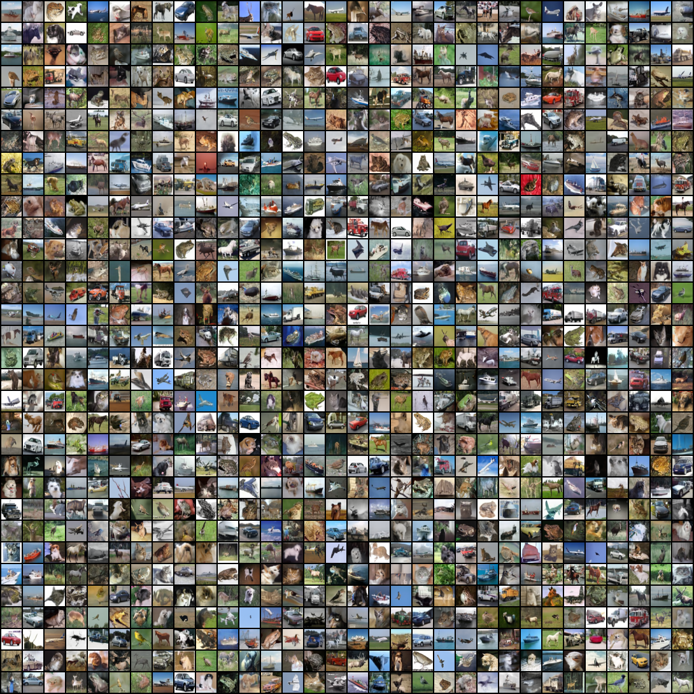
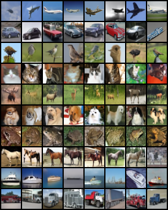
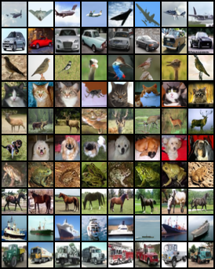
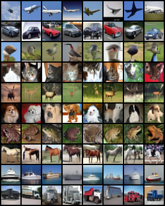
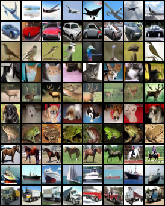
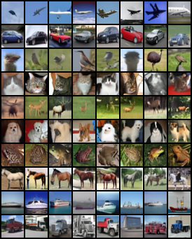
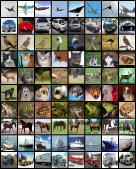

# CIFAR-10 扩散模型实验记录（含 CFG）📋

# 1. 普通扩散模型实验结果 📝

## 1.1 总览 📊

| 序号 | 模型            | 轮次  | GPU                  | Batch / LR | 调度器               | 保存与采样频率                            | 总耗时（训+采）                                              |
| ---- | --------------- | ----- | -------------------- | ---------- | -------------------- | ----------------------------------------- | ------------------------------------------------------------ |
| 1    | Diffusion Mamba | 20000 | V100 32G × 8（用 3） | 128 / 1e-4 | 20 轮线性预热 → 余弦 | 每 50 轮存模；500 轮起每 100 轮采样 16 张 | 大概36h（前4169轮） + 362.0h 16.0m 33.021355390548706s（最后训练到20000轮，断点续训） |

## 1.2 Diffusion Mamba（V100 32G × 8，用 3 张）🐍

### 1.2.1 训练 🚀

| 项目               | 数值                                                         |
| ------------------ | ------------------------------------------------------------ |
| 训练集             | CIFAR-10，32×32，50,000 张                                   |
| 训练轮数           | 20000                                                        |
| GPU                | V100 32G × 8（用 3）                                         |
| Batch / workers    | 128 / 8                                                      |
| 学习率             | 1e-4                                                         |
| 调度器             | 20 轮线性预热 → 余弦                                         |
| 存模频率           | 每 50 轮                                                     |
| 采样频率（训练中） | 从第 500 轮起，每 100 轮采 16 张                             |
| 单轮耗时           | 1m 17 s                                                      |
| 采样耗时（16 张）  | 25 s                                                         |
| 总耗时（训+采）    | 大概36h（前4169轮） + 362.0h 16.0m 33.021355390548706s（最后训练到20000轮，断点续训） |

### 1.2.2 采样 🌈

- 硬件：单卡 V100 32G（8卡机其中 1 卡）

1024张图片：

  

### 1.2.3 评估 📐

- 硬件：单卡 V100 32G（8 卡机其中 1 卡）
- 测试集：CIFAR-10，32×32，10,000 张
- Batch size：512

| 模型 | FID $\downarrow$ | IS $\uparrow$ | LPIPS_diversity $\uparrow$ | 耗时 |
| --- | --- | --- | --- | --- |
| 训练 20000 轮模型，MSE最低模型 | 13.541 | 7.148 (±0.173) | 0.2175 | 3.0h 47.0m 27.961907386779785s |
| 训练18880轮模型 | 13.603 | 7.324 (±0.146) | 0.2224 | 3.0h 51.0m 26.17113709449768s |

> 说明：训练时 MSE 最低不一定评估最佳，建议对多份存档评估后再选最终模型.

# 2. 条件扩散模型实验结果 📝

## 2.1 总览 📊

| 序号 | 模型 | 训练 CFG | 轮次 | GPU | Batch / LR | 调度器 | 保存与采样频率 | 总耗时（训+采） |
| --- | --- | --- | --- | --- | --- | --- | --- | --- |
| 1 | UNet | 1.3 | 3000 | Titan XP 12G × 8（用 7） | 128 / 2e-4 | 20 轮线性预热 → 余弦 | 每 50 轮存模；400 轮起每 50 轮采样 16 张 | 42h 39m 57.844s |
| 2 | Diffusion Mamba | 1.3 | 4000 | V100 32G × 8（用 5） | 128 / 1e-4 | 20 轮线性预热 → 余弦 | 每 50 轮存模；500 轮起每 50 轮采样 16 张 | 36.0h 49.0m 25.928287744522095s（前2500轮） + 22.0h 16.0m 42.74389672279358s（后1500轮，断点续训） |
| 3 | Diffusion Transformer | 1.3 | 5000 | V100 32G × 8（用 2） | 128 / 1e-4 | 余弦 | 每 50 轮存模；200 轮起每 50 轮采样 16 张 | 165.0h 9.0m 10.177897930145264s |

---

## 2.2 UNet（Titan XP 12G × 8，用 7 张）🧠

### 2.2.1 训练 🚀
| 项目 | 数值 |
| --- | --- |
| 训练集 | CIFAR-10，32×32，50,000 张 |
| 训练轮数 | 3000 |
| 训练 CFG | 1.3 |
| GPU | Titan XP 12G × 8（用 7） |
| Batch / workers | 128 / 4 |
| 学习率 | 2e-4 |
| 调度器 | 20 轮线性预热 → 余弦 |
| 存模频率 | 每 50 轮 |
| 采样频率（训练中） | 从第 400 轮起，每 50 轮采 16 张 |
| 单轮耗时 | 45 s |
| 采样耗时（16 张） | 1m 28s |
| 总耗时（训+采） | 42h 39m 57.844s |

### 2.2.2 采样 🌈

#### 2.2.2.1 采样数据
- 硬件：单卡 Titan XP 12G（8 卡机其中 1 卡）

| 方法 | 采样 CFG | 步数 | 张数 | 耗时 |
| --- | --- | --- | --- | --- |
| DDIM | 3.0 | 50 | 10 类 × 每类 8 张 | 1m 11.112844705581665s |
| DDPM | 3.0 | 1000 | 10 类 × 每类 8 张 | 18m 29.092360973358154s |

#### 2.2.2.2 📷 采样结果

(左：DDIM 50 步 | 右：DDPM 1000 步)

  
  

#### 2.2.2.3 🎞️ 去噪过程 GIF 动画

DDIM 50 步采样过程 GIF 动画：

  

### 2.2.3 评估 📐

- 硬件：单卡 Titan XP 12G（8 卡机其中 1 卡）
- 测试集：CIFAR-10，32×32，10,000 张
- Batch size：512

| 模型 / CFG | FID $\downarrow$ | IS $\uparrow$ | LPIPS_diversity $\uparrow$ | 耗时 |
| --- | --- | --- | --- | --- |
| MSE 最低模型，CFG=1.4 | 8.157 | 8.219 (±0.207) | 0.2276 | 10.0h 7.0m 15.607905149459839s |
| 训练 3000 轮模型，CFG=3 | 10.648 | 8.951 (±0.306) | 0.239 | 10.0h 18.0m 1.7773709297180176s |

> 说明：训练时 MSE 最低不一定评估最佳，建议对多份存档评估后再选最终模型。

---

## 2.3 Diffusion Mamba（V100 32G × 8，用 5 张）🐍

### 2.3.1 训练 🚀
| 项目 | 数值 |
| --- | --- |
| 训练集 | CIFAR-10，32×32，50,000 张 |
| 训练轮数 | 4000 |
| 训练 CFG | 1.3 |
| GPU | V100 32G × 8（用 5） |
| Batch / workers | 128 / 4 |
| 学习率 | 1e-4 |
| 调度器 | 20 轮线性预热 → 余弦 |
| 存模频率 | 每 50 轮 |
| 采样频率（训练中） | 从第 500 轮起，每 50 轮采 16 张 |
| 单轮耗时 | 45 s |
| 采样耗时（16 张） | 51 s |
| 总耗时（训+采） | 36.0h 49.0m 25.928287744522095s（前2500轮） + 22.0h 16.0m 42.74389672279358s（后1500轮，断点续训） |

### 2.3.2 采样 🌈

#### 2.3.2.1 采样数据
- 硬件：单卡 V100 32G（8 卡机其中 1 卡）

| 方法 | 采样 CFG | 步数 | 张数 | 耗时 |
| --- | --- | --- | --- | --- |
| DDIM | 3.0 | 50 | 10 类 × 每类 8 张 | 25.999541521072388s |
| DDPM | 3.0 | 1000 | 10 类 × 每类 8 张 | 6.0m 46.34597706794739s |

#### 2.3.2.2 📷 采样结果

(左：DDIM 50 步 | 右：DDPM 1000 步)

  
  

### 2.3.3 评估 📐

- 硬件：单卡 V100 32G（8 卡机其中 1 卡）
- 测试集：CIFAR-10，32×32，10,000 张
- Batch size：512

| 模型 / CFG | FID $\downarrow$ | IS $\uparrow$ | LPIPS_diversity $\uparrow$ | 耗时 |
| --- | --- | --- | --- | --- |
| 训练 3350 轮模型，CFG=3 | 15.999 | 8.745 (±0.192) | 0.238 | 7.0h 45.0m 57.806638956069946s |
| 训练 4000 轮中MSE 最低模型，CFG=1.8 | 12.090 | 7.810 (± 0.190) | 0.232 | 15.0h 49.0m 9.043614387512207s |

---

## 2.4 Diffusion Transformer（V100 32G × 8，用 2 张）🧠⚡

### 2.4.1 训练 🚀
| 项目 | 数值 |
| --- | --- |
| 训练集 | CIFAR-10，32×32，50,000 张 |
| 训练轮数 | 5000 |
| 训练 CFG | 1.3 |
| GPU | V100 32G × 8（用 2） |
| Batch / workers | 128 / 4 |
| 学习率 | 1e-4 |
| 调度器 | 余弦 |
| 存模频率 | 每 50 轮 |
| 采样频率（训练中） | 从第 200 轮起，每 50 轮采 16 张 |
| 单轮耗时 | 1m 51s |
| 采样耗时（16 张） | 50 s |
| 总耗时（训+采） | 165.0h 9.0m 10.177897930145264s |

### 2.4.2 采样 🌈

#### 2.4.2.1 采样数据

- 硬件：单卡 V100 32G（8 卡机其中 1 卡）

| 方法 | 采样 CFG | 步数 | 张数 | 耗时 |
| --- | --- | --- | --- | --- |
| DDIM | 3.0 | 50 | 10 类 × 每类 8 张 | 24.76508355140686s |
| DDPM | 3.0 | 1000 | 10 类 × 每类 8 张 | 6.0m 36.380266427993774s |

#### 2.4.2.2 📷 采样结果

(左：DDIM 50 步 | 右：DDPM 1000 步)

  
  

### 2.4.3 评估 📐

- 硬件：单卡 V100 32G（8 卡机其中 1 卡）
- 测试集：CIFAR-10，32×32，10,000 张
- Batch size：512

| 模型 / CFG | FID $\downarrow$ | IS $\uparrow$ | LPIPS_diversity $\uparrow$ | 耗时 |
| --- | --- | --- | --- | --- |
| 训练 5000 轮中MSE 最低模型，CFG=2.4 | 11.573 | 8.689 (±0.230) | 0.237 | 7.0h 28.0m 42.17308187484741s |
| 训练 5000 轮中MSE 最低模型，CFG=1.8 | 10.465 | 8.323 (± 0.241) | 0.235           | 7.0h 17.0m 56.996381759643555s |
| 训练 5000 轮模型，CFG=3             | 13.131 | 9.038 (± 0.338) | 0.237           | 7.0h 15.0m 37.65322971343994s  |